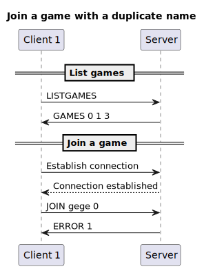
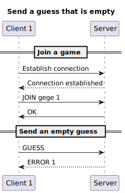
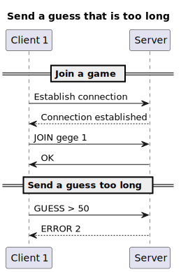

# Hangman protocol

## Section 1 - Overview

The Hangman protocol is a gaming protocol that define the interaction between a server which host a game of Hangman and a client that will play the game.  
It will also let multiple players play against each others.

## Section 2 - Transport protocol

The Hangman protocol state of a game transport protocol. It must use the TCP
(Transmission Control Protocol) to ensure the reliability of data transmission, because it doesn't need fast data transmission. The protocol must also use port 1902.

Every message must be encoded in UTF-8 and delimited by a newline character
(`\n`). The messages are treated as text messages.

The initial connection must be established by the client.

Once the connection is established, the client can join the server with a given
username.

The server must verify that the username is not already taken by another user, it will act as a unique id.

If these conditions are met, the server allows the client to join and create a  

Otherwise, the server denies the client access.

The client will then send his guesses for the current word to guess.

The server must verify that the recipient is connected and that the message does
not exceed 50 characters and that it's at least 1 character long.

If these conditions are met, the server update the info of the player which guessed a letter.

Otherwise, the server sends an error message to the client who sent the message.

On an unknown message, the server must send an error message to the client.

Once a game is finished, the server tell all clients of the game that it is finished.
Once all the clients have disconnected, the server must close the connection and remove
the client from the list of connected clients of that game.

## Section 3 - Messages

### Join a game

The client sends a join message to the server indicating the client's username.

#### Request

```text
JOIN <name> <game_id>
```

- `name`: the name of the player
- `game_id`: the id of the game to join

#### Response

- `OK`: the client has been granted access to the server and the game
- `ERROR <code>`: an error occurred during the join. The error code is an
  integer between 1 and 2 inclusive. The error codes are as follow:
    - 1: the client's name is already in use.
    - 2: the game_id is not a number.

### List available games

The client sends a message to the server to request the list of games that can be joined.

#### Request

```text
LISTGAMES
```

#### Response

- `GAMES <game1_id> <game2_id> <game3_id> ...`: the list of games id.
  The games id are separated by a space.

### Send a guess

The client sends a guess to the server. The server is then responsible for updating the state of the game and sending
it to all the players of the game.

#### Request

```text
GUESS <guess>
```

#### Response

- `CURRENTGUESS <string>`: returns a string containing the good guesses. for example: "A____".
- `ERROR <code>`: an error occurred while sending the guess. The error code is an integer between 1 and 2 inclusive. The error codes are as follow:
    - 1: the message is empty
    - 2: the message exceeds 50 characters

### Receive a guess

The server sends a state of the game to the other players which are in the same game indicating the progress of the client which guessed. All clients are then responsible for displaying the informations.

#### Request

```text
GAMEUPDATE <nb_live_left> <nb_good_guess> <is_winner> <player>
```

- `nb_live_left`: the number of lives left of the player
- `nb_good_guess`: the number of correct guess of the player
- `is_winner`: an int which is 1 if the player has won, 0 if not
- `player`: the name of the corresponding player

#### Response

None.

### Leave a game

The client send a message to the server to leave the game in which he currently is.

#### Request

```text
LEAVE <username> <game_id>
```

- `username`: the username of the player which want to leave.
- `game_id`: the game in which the player is.

#### Response

- `LEFT <username>`: returns the name of the player that left
- `ERROR <code>`: an error occurred while trying to leave the game. The error code is an integer between 1 and 3 inclusive. The error codes are as follow:
-  1: invalid room ID
-  2: room does not exist
-  3: player not in the room

### Left a game

The server sends a message to all client which are in the game of a player that left.

#### Request

```text
LEFT <username>
```

- `username`: the name of the player that left.

#### Response

None.

## Section 4 - Examples

### Functional example


### Join with duplicate name



### Send empty guess



### Send too long guess



### Join a game with an wrong format game id


### Leave a game with inexistant game id


### Leave a game with invalid game id


### Leave a game with wrong game id


